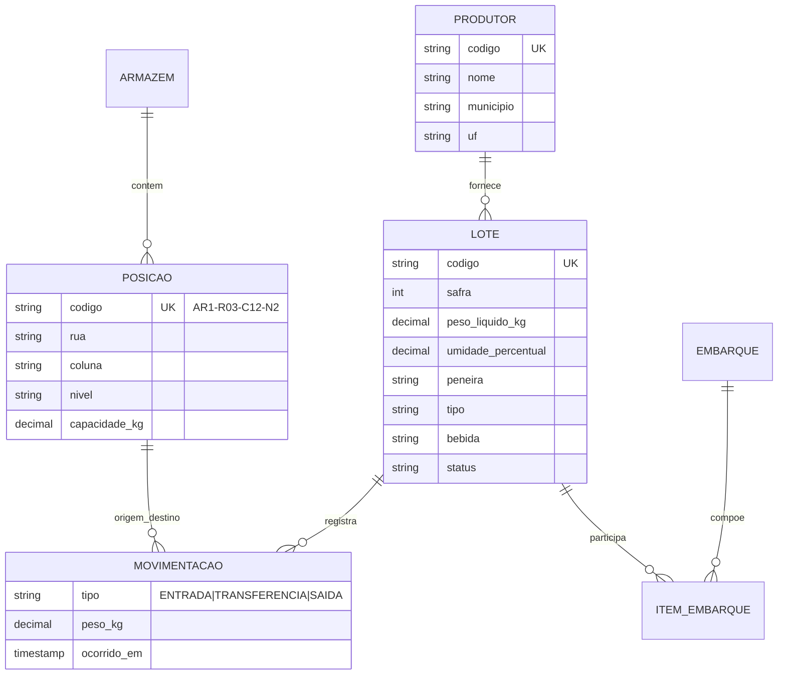

# Coffee Warehouse API

API REST de **rastreabilidade e movimentação de lotes de café armazenado**, modelada a partir de conceitos reais de WMS (Warehouse Management System) para armazéns de café.

> Projeto de estudo/portfólio. O domínio é modelado a partir de **conhecimento público do setor** (classificação COB por peneira/tipo/bebida, endereçamento genérico de armazém). Não reproduz regra de negócio, layout ou estrutura de dados de nenhuma empresa.

---

## Por que este projeto existe

A maioria dos projetos de portfólio em Spring Boot é um CRUD sem regra de negócio. Este aqui foi construído em torno de uma decisão de arquitetura específica:

**O saldo não é uma coluna — é uma agregação do histórico.**

Não existe `posicao.ocupacao_atual` nem `lote.peso_disponivel`. Toda ocupação de posição e todo saldo de lote são derivados da tabela `movimentacao`, que é **append-only**: nunca sofre `UPDATE` nem `DELETE`.

| | Estado mutável | Ledger append-only (escolhido) |
|---|---|---|
| Leitura | Barata | Mais cara (agregação) |
| Auditoria | Precisa de tabela paralela | Sai de graça |
| Dessincronização | Possível | Impossível por construção |
| Concorrência | Race condition em `UPDATE` | Resolvida na validação do saldo |

O trade-off é consciente: paga-se custo de leitura para ganhar auditabilidade total e eliminar uma classe inteira de bugs de inventário.

---

## Modelo de domínio



### Invariantes do domínio

- A soma alocada em uma posição nunca excede `capacidade_kg`
- Transferência exige saldo suficiente na posição de origem
- Lote com status `EMBARCADO` é imutável (estado terminal)
- Sugestão de separação segue FIFO por safra
- Blend de embarque calcula média de umidade e classificação **ponderada por peso**

### Ciclo de vida do lote

```
AGUARDANDO_ALOCACAO -> ARMAZENADO -> RESERVADO -> EMBARCADO
```

---

## Stack

| Camada | Tecnologia |
|---|---|
| Linguagem | Java 21 |
| Framework | Spring Boot 3.5 (Web, Data JPA, Validation, Actuator) |
| Banco | PostgreSQL 16 |
| Migrations | Flyway |
| Documentação | OpenAPI 3 / Swagger UI (springdoc) |
| Testes | JUnit 5, AssertJ, **Testcontainers** (Postgres real, sem H2) |
| Build & Deploy | Maven, Docker multi-stage, Docker Compose |
| CI | GitHub Actions |

---

## Como rodar

**Pré-requisitos:** Docker e Docker Compose. Nada além disso.

```bash
git clone https://github.com/MiguelGFerreira/coffee-warehouse-api.git
cd coffee-warehouse-api
docker compose up --build
```

| Recurso | URL |
|---|---|
| Swagger UI | http://localhost:8080/docs |
| OpenAPI JSON | http://localhost:8080/v3/api-docs |
| Health check | http://localhost:8080/actuator/health |

### Desenvolvimento local (app na IDE, banco no Docker)

```bash
docker compose up -d db
./mvnw spring-boot:run
```

### Testes

```bash
./mvnw verify
```

Os testes de integração sobem um PostgreSQL real via Testcontainers e aplicam as migrations do Flyway. Requer Docker rodando.

---

## Decisões técnicas

**`ddl-auto: validate`, nunca `update`.** O schema pertence ao Flyway. O Hibernate apenas valida se o mapeamento bate com o banco — se divergir, a aplicação não sobe. Falha rápido e explícito.

**Testcontainers no lugar de H2.** Testar contra H2 e rodar em Postgres significa que constraints, tipos `NUMERIC` e `CHECK` só são exercitados em produção. O container custa alguns segundos e elimina essa classe de surpresa.

**`open-in-view: false`.** Desliga o anti-pattern padrão do Spring Boot que mantém a sessão JPA aberta durante a renderização da resposta, escondendo N+1 e segurando conexão do pool além do necessário.

**Camadas com domínio rico, não hexagonal.** Em um projeto deste porte, ports/adapters vira cerimônia sem contrapartida. A regra de negócio vive na entidade quando pertence a ela; o service orquestra; o controller é fino.

**Controle de concorrência.** Duas transferências simultâneas para a mesma posição poderiam estourar a capacidade. Tratado com lock otimista (`@Version`) nas entidades — as colunas `version` já existem desde a migration baseline.

---

## Roadmap

- [x] **Fase 1** — Fundação: Docker Compose, Flyway, Actuator, CI, teste de integração
- [ ] **Fase 2** — Cadastros: Produtor, Lote, Armazém, Posição (CRUD, validação, tratamento de erro padronizado, paginação)
- [ ] **Fase 3** — Ledger de movimentação: entrada, transferência, saída, cálculo de saldo, invariantes
- [ ] **Fase 4** — Embarque e blend: composição, média ponderada, sugestão FIFO
- [ ] **Fase 5** — Acabamento: OpenAPI descrito, seed de dados, autenticação JWT

---

## Autor

**Miguel G. Ferreira** — Analista de Sistemas
[GitHub](https://github.com/MiguelGFerreira) · [LinkedIn](https://www.linkedin.com/in/miguelgferreira/) · [migueldev.tech](https://migueldev.tech)
