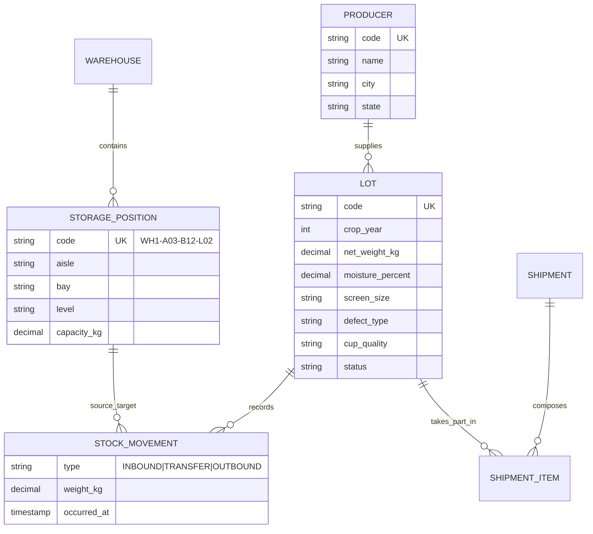

# Coffee Warehouse API
[](https://github.com/MiguelGFerreira/coffee-warehouse-api/actions/workflows/ci.yml)

REST API for **traceability and movement of stored coffee lots**, modeled on real WMS (Warehouse Management System) concepts for coffee warehouses.

> Study/portfolio project. The domain is modeled from **public industry knowledge** (COB classification by screen size / defect type / cup quality, generic warehouse addressing). It does not reproduce the business rules, layout or data structures of any company.

---

## Why this project exists

Most Spring Boot portfolio projects are a CRUD with no business rules. This one is built around one specific architectural decision:

**Balance is not a column — it is an aggregation over history.**

There is no `storage_position.current_occupancy` and no `lot.available_weight`. All position occupancy and all lot balances are derived from the `stock_movement` table, which is **append-only**: it never takes an `UPDATE` or a `DELETE`.

| | Mutable state | Append-only ledger (chosen) |
|---|---|---|
| Reads | Cheap | More expensive (aggregation) |
| Auditing | Needs a parallel table | Comes for free |
| Drift between the two | Possible | Impossible by construction |
| Concurrency | Race condition on `UPDATE` | Handled in the balance check |

The trade-off is deliberate: pay a read cost to gain full auditability and eliminate an entire class of inventory bugs.

---

## Domain model



### Domain invariants

- The sum allocated to a position never exceeds `capacity_kg`
- A transfer requires sufficient balance at the source position
- A lot with status `SHIPPED` is immutable (terminal state)
- Picking suggestion follows FIFO by crop year
- Shipment blend averages moisture and classification **weighted by weight**

### Lot lifecycle

```
AWAITING_ALLOCATION -> STORED -> RESERVED -> SHIPPED
```

---

## Stack

| Layer | Technology |
|---|---|
| Language | Java 21 |
| Framework | Spring Boot 3.5 (Web, Data JPA, Validation, Actuator) |
| Database | PostgreSQL 16 |
| Migrations | Flyway |
| Documentation | OpenAPI 3 / Swagger UI (springdoc) |
| Tests | JUnit 5, AssertJ, **Testcontainers** (real Postgres, no H2) |
| Build & Deploy | Maven, multi-stage Docker, Docker Compose |
| CI | GitHub Actions |

---

## Running it

**Prerequisites:** Docker and Docker Compose. Nothing else.

```bash
git clone https://github.com/MiguelGFerreira/coffee-warehouse-api.git
cd coffee-warehouse-api
docker compose up --build
```

| Resource | URL |
|---|---|
| Swagger UI | http://localhost:8080/docs |
| OpenAPI JSON | http://localhost:8080/v3/api-docs |
| Health check | http://localhost:8080/actuator/health |

### Local development (app in the IDE, database in Docker)

```bash
docker compose up -d db
./mvnw spring-boot:run
```

### Tests

```bash
./mvnw verify
```

The integration tests start a real PostgreSQL via Testcontainers and apply the Flyway migrations. Requires Docker running.

---

## Technical decisions

**`ddl-auto: validate`, never `update`.** The schema belongs to Flyway. Hibernate only validates that the mapping matches the database — if they diverge, the application does not start. Fail fast and explicitly.

**Testcontainers instead of H2.** Testing against H2 while running on Postgres means constraints, `NUMERIC` types and `CHECK`s are only exercised in production. The container costs a few seconds and removes that class of surprise.

**`open-in-view: false`.** Turns off the Spring Boot default anti-pattern that keeps the JPA session open while the response renders, hiding N+1 queries and holding a pool connection longer than necessary.

**Layered with a rich domain, not hexagonal.** In a project this size, ports/adapters is ceremony with no payoff. Business rules live in the entity when they belong to it; the service orchestrates; the controller is thin.

**Concurrency control.** Two simultaneous transfers into the same position could blow past capacity. Handled with optimistic locking (`@Version`) on the entities — the `version` columns have been there since the baseline migration.

**English domain vocabulary.** The domain was originally modeled in Portuguese and translated before Phase 2. The reasoning, the vocabulary table and the one-off migration exception it required are recorded in [docs/DECISIONS.md](docs/DECISIONS.md).

---

## Roadmap

- [x] **Phase 1** — Foundation: Docker Compose, Flyway, Actuator, CI, integration test
- [ ] **Phase 2** — Registry: Producer, Warehouse, StoragePosition, Lot (CRUD, validation, standardized error handling, pagination)
- [ ] **Phase 3** — Movement ledger: inbound, transfer, outbound, balance calculation, invariants
- [ ] **Phase 4** — Shipment and blend: composition, weighted average, FIFO suggestion
- [ ] **Phase 5** — Finishing: described OpenAPI, data seed, JWT authentication

---

## Author

**Miguel G. Ferreira** — Systems Analyst
[GitHub](https://github.com/MiguelGFerreira) · [LinkedIn](https://www.linkedin.com/in/miguelgferreira/) · [migueldev.tech](https://migueldev.tech)
